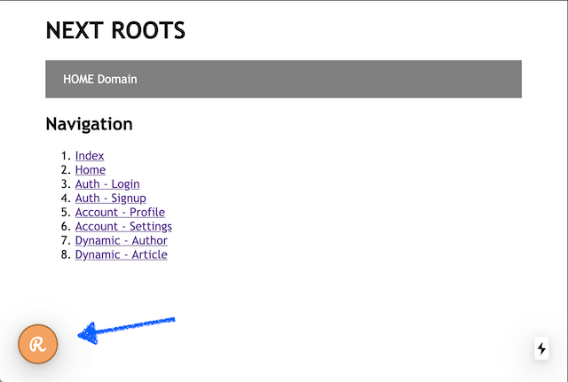
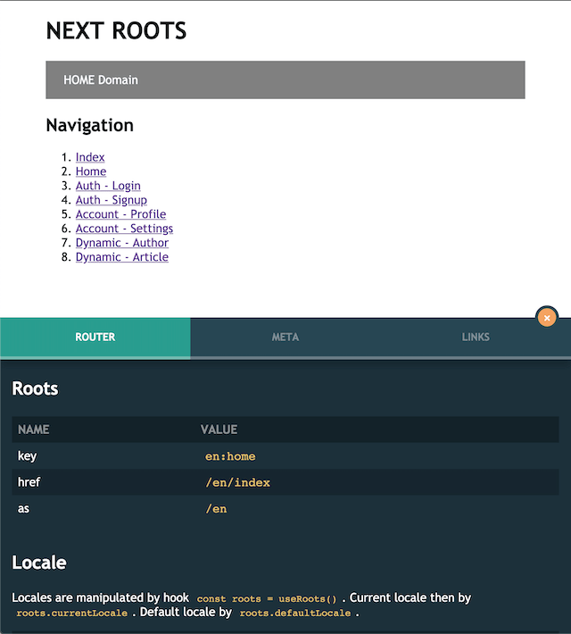

# next-roots

Next.js utility to generate internationalized (i18n) pages according to custom roots rules and with **no need to use Vercel dev server, Rewrites neither Routes**. The package has zero dependencies.

## 1. About next-roots

This package is highly inspired by [next-translate](https://github.com/vinissimus/next-translate#readme).
It solves some additional features like `static routing schema`, `URL tokenizing`, `page meta`, `injecting config directly to pages` ... and is completely **TypeScript friendly!**

Similar to `next-translate` this package holds all pages implementation in a separate directory. We call it `roots`. Required `pages` directory is then created during `build` time.

## 2. Getting started

A complete example can be seen in the `example` directory.

### Installation

1. Add the package to your project dependencies

`yarn add next-roots`

2. Add pages builder script to your `package.json`

```json
{
  "scripts": {
    "dev": "yarn next-roots && next dev",
    "build": "yarn next-roots && next build"
  }
}
```

3. Create [roots.config.js](#config-options) in your project root
4. Add [RootsContext](#rootscontext) to your `_app`
5. Run `yarn dev`

### How to use it

The default behavior is to have a `roots.config.js` file placed in your project root folder (next to your package.json file).

This file defines roots schema for your pages and config params for pages builder.

Basic configuration can look like:

```js
module.exports = {
  locales: ['en', 'cs'],
  defaultLocale: 'cs',
  defaultSuffix: '.htm',
  schemas: [
    {
      root: '*',
      metaData: [
        {
          locale: '*',
          data: { title: 'Next Roots', background: 'grey' },
        },
      ],
    },
    {
      root: 'home',
      pages: [{ locale: '*', path: 'index', suffix: '' }],
    },
    {
      root: 'auth/signup',
      pages: [
        { locale: 'en', path: 'auth/signup-:token' },
        { locale: 'cs', path: 'overeni/registrace-:token' },
      ],
      params: { token: 'p1' },
      metaData: [
        { locale: 'en', data: { title: 'Signup' } },
        { locale: 'cs', data: { title: 'Registrace' } },
      ],
    },
    {
      root: 'dynamic',
      pages: [{ locale: '*', path: '[...slug]', suffix: '' }],
      params: { token: 'p1' },
      metaData: [{ locale: '*', data: { background: 'magenta' } }],
    },
  ],
}
```

> NOTE: all following examples are based on above config.

Before you run a build process with the above config your project structure needs to look like this:

```bash
.
├── roots
│ ├── home.tsx
│ ├── dynamic.tsx
│ └── auth
│ └── signup.tsx
```

After you run a build process with the above config your project structure will look like this:

```bash
.
├── roots
│ ├── home.tsx
│ └── auth
│ └── signup.tsx
├── pages
│ └── en
│ └── index.tsx
│ └── [...slug].tsx
│ └── auth
│ └── signup-p1.htm.tsx
│ └── cs
│ └── index.tsx
│ └── [...slug].tsx
│ └── auth
│ └── registrace-p1.htm.tsx
```

Static schema file `roots.schema.js` will also be generated and placed to the project root folder. This file contains a routing map for each page in your roots configuration, available locales, and default locale.

```js
module.exports = {
  locales: ['en', 'cs'],
  defaultLocale: 'cs',
  rules: [
    {
      key: 'en:home',
      href: '/en',
    },
    {
      key: 'cs:home',
      href: '/cs',
    },
    {
      key: 'en:auth/signup',
      href: '/en/auth-signup-p1.htm',
    },
    {
      key: 'cs:auth/signup',
      href: '/cs/ucet-registrace-p1.htm',
    },
    { key: 'en:dynamic', href: '/en/[...slug]' },
    { key: 'cs:dynamic', href: '/cs/[...slug]' },
  ],
}
```

> NOTE: If some rule does not contain `as` it means that it is the same as `href`.

## 3. Configuration

| Name          | Default                                         | Description                                                     |
| ------------- | ----------------------------------------------- | --------------------------------------------------------------- |
| schemas       | []                                              | builder rules for generating pages                              |
| locales       | []                                              | all allowed locales which will be generated                     |
| defaultLocale | ''                                              | locale which will be used as default when no locale is detected |
| defaultSuffix | ''                                              | default page suffix which will be added to page name            |
| basePath      | `.`                                         | path to base folder where roots and pages are located                |
| dirRoot       | `roots`                                         | source folder with all roots files                              |
| dirPages      | `pages`                                         | target folder where pages will be generated into                |
| staticRoots   | `['api', '_app', '_document', '_error', '404']` | static roots which will be generated outside locales folders    |
| extRoots      | `['.tsx']`                                      | suffix of all roots files                                       |

## 4. Schemas

Each schema rule represents one `root + page` combination. This is the main way how to define the routing map for your localized pages.

```js
{
 root: 'auth/signup',
 pages: [
 { locale: 'en', path: 'auth/signup-:token' },
 { locale: 'cs', path: 'auth/registrace-:token' },
 ],
 params: { token: 'p1' },
 metaData: [
 { locale: 'en', data: { title: 'Signup' } },
 { locale: 'cs', data: { title: 'Registrace' } },
 ],
}
```

- `root` - source file path (will be used as root name if rootName options is empty)
- `rootName` - explicit root name (used when creating RootLinks)
- `pages` - localized aliases for current root
- `params` - params which will be used as replace value in page `path` or `alias` during build
- `metaData` - custom params which can will be injected directly into page and can by obtained using `useRootMeta` hook in runtime.

### Pages

Each schema rule must define pages array. Otherwise it must be defined as [prototype rule](#schema-prototype-rule).

```js
pages: [{
 locale: '*',
 path: 'index',
 suffix: ''
}],
```

- `locale` - the name of the folder where the page will be generated (use `*` to generate the same schema for all locales)
- `path` - page file name which will also be used for routing as link `href`
- `alias` - page alias which will be used for routing as link `as`
- `suffix` - custom suffix which will be appended to `path` param

### Meta data

Each schema rule can define custom metadata array. Each array item has to define two properties:

- `locale` - must be one of `locales` value or `*` to be used for each available locale
- `data` - custom values type of `Record<string, ReactText>`

```ts
metaData: [
 { locale: 'en', data: { background: 'magenta' } }
],
```

This data can be used to change layout, CSS, background images, ... based on your requirements.

### Schema prototype rule

Prototype rule is used for setting general/default metadata values which will be then merged with page-specific metadata values

```js
{
 	root: 'account/*',
	metaData: [
 		{ locale: '*', data: { background: 'red' } }
 		{ locale: 'en', data: { section: 'Account' } }
	],
	isPrototype: true
},
{
	root: 'account/profile',
	metaData: [
		{ locale: 'en', data: { title: 'Profile' } }
	],
	// ...
},
```

Final metadata for `account/profile` root will be then

```js
{
	background: 'red',
	section: 'Account',
	title: 'Profile'
}
```

Root property works here like RegExp. The prototype schema will be merged into any root passing the condition `realSchema.root.match(new Regexp(prototypeSchema.root))`

## 5. Hooks

The Next-roots package provides handy hooks to read and manipulate its context values.

### useRoots

Provides main roots values according to the current router path.

- `locales: string[]` - all active locales
- `defaultLocale: string` - default locale value
- `currentLocale: string` - current page locale
- `currentRoot: string` - current page root
- `currentRule: SchemaRule | undefined` - containing current rule `key`, `href` and optionally `alias`
- `currentMeta: SchemaMeta | undefined` - containing current page meta data

Example usage:

```ts
import { useRoots } from 'next-roots/context'

// router path = /en/auth/signup-p1.htm
const roots = useRoots()

roots.locales // ['en', 'cs', ...]
roots.defaultLocale // 'cs'
roots.currentLocale // 'en'
roots.currentRoot // 'auth/signup'
roots.currentRule // { key: 'en:auth/signup', href: '/en/auth/signup' }
roots.currentMeta // { key: 'en:auth/signup', data: { title: 'Signup', background: 'grey' } }
```

### useRootLink

Provides API to create localized links based on context rules.

Example usage:

```ts
import { useRootLink } from 'next-roots/link'

const link = useRootLink()

// 1. generates href with current locale using root name (currentLocale = en)
link.href('auth/signup')
// result: /en/auth/signup-p1.htm`

// 2. generates href with custom locale using root name and explicit locale option
link.href('auth/signup', { locale: 'cs' })
// result: `/cs/overeni/registrace-p1.htm`

// 3. generate href with custom locale using rule key and empty locale option
link.href('cs:auth/signup', { locale: '' })
// result: '/cs/overeni/registrace-p1.htm'

// 4. generate href with custom locale using current rule key and explicit locale option (currentRule = cs:auth/signup)
link.href('cs:auth/signup', { locale: 'en' })
// result: '/en/auth-signup-p1.htm'

// 5. generate href for dynamic page
link.href('dynamic', { locale: 'en' })
// result: '/en/[...slug]'

// 6. generate href for home page using shortcut
link.href('/', { locale: 'en' })
// result: '/en'
```

> NOTE: There is a predefined home page shortcut `/` in roots package. So you do not need to use `home` if you don't want to.

The same options work for link alias. Plus dynamic params can be explicitly pushed:

```ts
// same options as for link.href() plus:

const link = useRootLink()

// 1. generate alias for dynamic page
link.as('dynamic', { locale: 'en', params: { slug: 'some-slug' } })
// result: '/en/some-slug'
```

> NOTE: It is not practical to have all possible rules injected into every page because it makes page bundle size bigger in large applications. Therefore if your current page is `cs:auth/signup` you have access only to `cs` rules and to `auth/signup` rules with a different locale.

### useRootMeta

Provides API to read static metadata attached current page or its mutations.

Example usage:

```ts
// example values when current root is 'dynamic'
const meta = useRootMeta()

// 1. read all meta data for current router path (data is merged with general meta data - schema.meta.key === '*')
meta.data()
// result: { title: 'Next Roots', background: 'magenta' }

// 2. cherry pick meta data using custom selector for current router path
meta.data('background')
// result: 'magenta'

// 3. read all meta data for explicit rule key
meta.data('*', 'cs:auth/signup')
// result: { title: 'Next Roots', background: 'grey' }
```

> NOTE: It is not practical to have all possible metadata injected into every page because it makes page bundle size bigger in large applications. Therefore if your current page is `cs:auth/signup` you have access only to its current metadata and metadata with a different locale but the same root.

## 6. Components

The Next-roots package provides ready-to-use components with injected roots context.

### RootsContext

Main roots context component which holds current values according to the current page.

This component is required to use in your app so that other components can consume the context of the current root.

Recommended usage:

```tsx
// in your _app.tsx
import RootsContext, { detectRoots } from 'next-roots/context'
import { AppProps } from 'next/app'

function MyApp({ Component, pageProps }: AppProps) {
  // detect roots context from page component
  // - current values will be obtained from Component.getRootsContext
  // - second argument holds default values
  const roots = detectRoots(Component, {
    defaultLocale: 'en',
    locales: ['en', 'cs', 'es'],
  })

  return (
    <RootsContext.Provider value={roots}>
      <Component {...pageProps} />
    </RootsContext.Provider>
  )
}

export default MyApp
```

### RootLink

Extends native `link/next` with roots context. Generates links based on roots schema when a rule is found otherwise link generation is handled by native link component.

Works similar to `useRootLink` as this hook is used under the hood of the `RootLink` component.

Example usage:

```tsx
import RootLink from 'next-roots/link';

// 1. Using with current locale and root name (currentLocale = en)
<RootLink href="auth/signup">
 <a>...</a>
</RootLink>
// result <a href="/en/auth/signup-p1.htm">...</a>

// 2. Using with the custom locale and root name
<RootLink href="auth/signup" locale="cs">
 <a>...</a>
</RootLink>
// result <a href="/cs/overeni/registrace-p1.htm">...</a>

// 3. Using with rule key and empty locale option
<RootLink href="cs:auth/signup" locale="">
 <a>...</a>
</RootLink>
// result <a href="/cs/overeni/registrace-p1.htm">...</a>

// 4. Using with rule key and custom locale
<RootLink href="cs:auth/signup" locale="en">
 <a>...</a>
</RootLink>
// result <a href="/en/auth/signup-p1.htm">...</a>

// 5. Using with dynamic root (e.g. page = [...slug])
<RootLink href="dynamic" locale="en" params={{slug: 'some-slug'}}>
 <a>...</a>
</RootLink>
// result <a href="/en/auth/some-slug">...</a>

// 6. Using home page shortcut (currentLocale = en)
<RootLink href="/">
 <a>...</a>
</RootLink>
// result <a href="/en">...</a>

```

### RootsConsole

It is possible to use <RootsConsole /> component to debug whole Roots context values.

```js
import RootsConsole from 'next-roots/console'

//
function MyLayout() {
  return (
    <div>
      // ... custom logic
      <RootsConsole />
    </div>
  )
}
```

Once this component is mounted to the DOM following indicator will appear in the bottom left corner of the window:



The console will open once that indicator is clicked:



All current context values like `currenLocale`, `currentRoot` or `currentMeta` can be found in this console. Also, links to current page mutations (locales) can be found in a tab called `links`.

> Note that `RootsConsole` component should be used only in dev and should be removed before deploying to production

## 7. Special page method

Next.js provides us with special page methods like `getServerSideProps`, `getStaticProps`, `getStaticPaths` and `getInitialProps (will be deprecated)`.

All these methods are parsed during build time and forwarded from generated pages. The current page `locale` is also pushed to the context of some of these methods.

For example if you have `root` named `dynamic` which contains two of mentioned methods (getStaticProps, getStaticPaths) the result will look like:

```ts
import { GetStaticPaths, GetStaticProps } from 'next'
import DynamicRoot, * as __root from 'roots/dynamic'

// ... custom logic

// @ts-ignore
export const getStaticProps: GetStaticProps = async (context) =>
  __root.getStaticProps({ ...context, __locale: 'cs' })

export const getStaticPaths: GetStaticPaths = async () =>
  __root.getStaticPaths()

export default DynamicPage
```

Then your are able to read page locale directly inside your root's special methods:

```ts
export const getStaticProps: GetStaticProps = async (context) => {
  const { __locale, ...ctxOthers } = context
  // ... custom logic
}
```

## 8. Example

Example usage with lightweight schema can be found in the example folder

- `cd example`
- `yarn install`
- `yarn dev`

## 9. Migrating from 1.x to 2.x

Refactor has been done to keep page bundles size as small as possible. Therefore including `roots.schema.js` file in your `_app` (or anywhere else) is not required anymore.

> The only possible case for using `roots.schema.js` is handling tokenized page redirects like `/en/p1.htm` >>> `/en/auth/signup-p1.htm` in your [catchAllRoute] page

The `parsePathname` util has been replaced with `detectRoots` and is no longer dependent on the router pathname. Context values are obtained from the `PageComponent.getRootsContext` which is generated during build time.

Rules and metadata are now directly injected to page file during build time BUT to keep page size bundle small only rules and meta with same locale or root are injected.

Migrating to 2.x requires two steps:

### 1. Update `_app`:

```tsx
// BEFORE 2.0.0
import RootsContext, { parsePathname } from 'next-roots/context'
import schemaRoots from 'roots.schema'
import { AppProps } from 'next/app'

function MyApp({ Component, pageProps }: AppProps) {
  // parse current roots values from router pathname
  const { locale, root, rule } = parsePathname(router.pathname, schema)

  return (
    <RootsContext.Provider
      value={{
        currentRule: rule,
        currentRoot: root,
        currentLocale: locale || schema.defaultLocale,
        defaultLocale: schema.defaultLocale,
        locales: schema.locales,
        rules: schema.rules,
        meta: schema.meta,
      }}
    >
      <Component {...pageProps} />
    </RootsContext.Provider>
  )
}

export default MyApp
```

```tsx
// AFTER 2.0.0
import RootsContext, { detectRoots } from 'next-roots/context'
import { AppProps } from 'next/app'

function MyApp({ Component, pageProps }: AppProps) {
  // detect roots context from page component
  const roots = detectRoots(Component, {
    defaultLocale: 'en',
    locales: ['en', 'cs', 'es'],
  })

  return (
    <RootsContext.Provider value={roots}>
      <Component {...pageProps} />
    </RootsContext.Provider>
  )
}

export default MyApp
```

### 2. Update `roots.config.js`

```js
// BEFORE 2.0.0
{
  root: 'some-root-name',
  pages: [
    {
      locale: 'en',
      metaData: { background: 'blue' },
      // ... other page config
    }
  ],
  metaData: { title: 'Next Roots', background: 'grey' },
},

```

```js
// AFTER 2.0.0
{
  root: 'some-root-name',
  pages: [
    {
      locale: 'en',
      // ... other page config
    }
 ],
  metaData: [
    { locale: '*', data: { title: 'Next Roots', background: 'grey' } }
    { locale: 'en', data: { background: 'blue' } }
  ],
},

```

## 10. Experimental

Following options are experimental and should not be used in production yet.

### Generate pages outside locale folders

To generate localized pages directly inside `pages` directory and ignore its enclosing locale folder the following configuration is required:

```js
// roots.config.js
{
  shallowLocales: ['en']
  // ...other options
}
```
